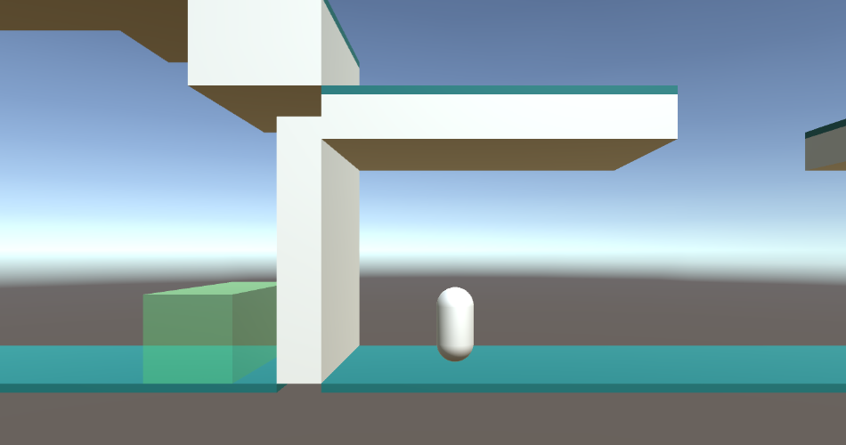

# LeoEcsLite Platformer

Platformer game prototype made with Unity using both ECS and OOP approaches

## Project features

### General

- Using Contexts (Main, UI, Level) to separate application logic
- Using Service Locator to provide Services across application
- Using ECS for gameplay logic
- Using OOP for UI logic

### ECS
- Using separate Worlds for Events and Components
- Using DI for Systems
- Using Converters to create Entities and Components via Inspector
- Using Debug Systems

### UI
- Using Mediators and Commands to handle UI Panels
- Using Factories to create Mediators

## Future plans

- Using DI to provide Services not only to ECS Systems, but also to Commands and etc.
- New gameplay mechanics (such as health system and enemies)
- Multiplayer
- Assembly definitions
- Unit Testing
- UI Mediators rework to reduce boilerplate

## Credits

Project made with Unity 2021.3.3f1. Packages used:

- LeoEcsLite (https://github.com/Leopotam/ecslite)
- LeoECS Lite DI (https://github.com/Leopotam/ecslite-di)
- LeoECS Lite Дополнительные системы (https://github.com/Leopotam/ecslite-extendedsystems)
- Интеграция в редактор Unity для LeoECS Lite (https://github.com/Leopotam/ecslite-unityeditor)
- Глобальные данные (https://github.com/Leopotam/globals)
- LeoECS Lite Physics (https://github.com/supremestranger/leoecs-lite-physics)
- LeoEcsLite Entity Converter (https://github.com/AndreyBirchenko/LeoEcsLiteEntityConverter)
